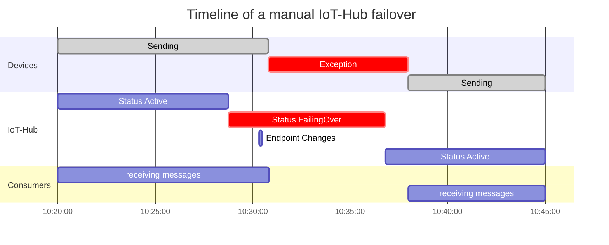

Use [Mermaid Live Editor](https://mermaid-js.github.io/mermaid-live-editor/) to convert it to svg or png

```mermaid
gantt
    dateFormat  HH:mm:ss
    title Timeline of a manual IoT-Hub failover
    axisFormat  %H:%M:%S

    section Devices
    Sending                            : done, device_sending1, 10:20:00,  10:30:49
    Exception                          : crit, device_error, after device_sending1,  10:37:58
    Sending                            : done, device_sending2, after device_error, 10:45:00
    
    section IoT-Hub
    Status Active                      :       iot_active1, 10:20:00, 10:28:46
    Status FailingOver                 : crit, failingOver, after iot_active1, 10:36:49
    Endpoint Changes:                  :       endpoint_change, 10:30:19, 10s
    Status Active                      :       iot_active2, after failingOver, 10:45:00
        
    section Consumers
    receiving messages                 :    consumer_receiving1, 10:20:00, 10:30:50

    receiving messages                 :    consumer_receiving2, 10:37:58, 10:45:00
```