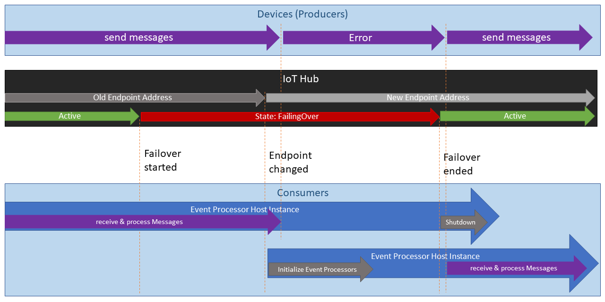

# Idea to minimize impact

The idea / approach we used to minimize the impact due to downtime, was to start a new EventProcessorHost for the IoT Hub as soon as the change of the connection string of the built-in Event Hub compatible endpoint was detected, see [Monitoring IoT Hub failover via API](monitoring-failover-via-api.md).

In an ideal scenario a control plane application observes the IoT Hub for failover and uses a state machine to control the orchestration of the consumers.

The diagram shows the timeline of a failover regarding our approach.

1. The failover is initiated: Status of the IoT Hub changes from Active to FailingOver.  
   The Consumer Process observes the change of the status and reports _Failover started_.     
   The Device Clients are still able to send messages and the consumers receive these messages.
2. The built-in Event Hub-compatible endpoint of the IoT Hub changes.  
   The Consumer Process observes that the _Endpoint changed_ and starts a new Event Processor Host Instance connecting to the new endpoint.
   The Device Clients might still able to send messages and the consumers receive these messages.
3. The IoT Hub stops forwarding messages.  
   The Device Client start getting errors when sending messages.  
   The Consumer process does no longer receive messages as none are forwarded.  
4. The Status of the IoT Hub switches back from FailingOver to Active.  
   The Consumer Process observes that the _Failover ended_ and shuts down the old Event Processor Host. This gives the old Event Processor Host enough time to complete.  
5. The Devices are no longer getting errors and start sending messages successfully again.  
   The new Consumer Process starts receiving the messages.

# Consumer: Event Processor Host

The Event Processor has several points that can lead to problems during a failover if not properly handled:

* change of connection string
* storage for leases and checkpoints
* blocked management API

## Connection string
The connection string of the built-in EventHub compatible endpoint changes during failover. The EventProcessorHost can not change the connection string while it is running. Therefore, the existing EventProcessorHost needs to be closed and a new EventProcessorHost with the new connection string needs to be created.

[Rebuilding the Connection string](monitoring-failover-via-api.md#Rebuilding-the-Connection-string) describes how to build the connection string after the change was detected.

## Storage

The EventProcessorHost stores the state for the leases and the checkpoints on the blob storage. 

Having a unique name for the storage blobs used by EventProcessorHost is therefore essential. This can be accomplished by passing a unique string to the _storageBlobPrefix_ constructor parameter of the EventProcessorHost.

Running the EventProcessorHosts in parallel can otherwise lead to problems, because of both cases: lease management and checkpointing.

If checkpointing is disabled but the same storage is used, the two EventProcessorHosts start competing for the leases as long as both are running, this happens until the old EventProcessorHost loses the connection to the old built-in endpoint.

If checkpointing is used and the blob entries are not deleted or have a different name, the consumer throws error messages after reconnect, telling that the supplied offset from the storage is invalid as it is higher than the current offset from the new IoT Hubs built-in Event Hub compatible endpoint. This continues until the IoT Hubs offset is higher than the stored Event Hub.

## Blocked management API calls during failover

We observed that some API calls such as getting the keys or creating a consumer group are blocking during the failover. Therefore, these calls need to be done before the failover starts.
